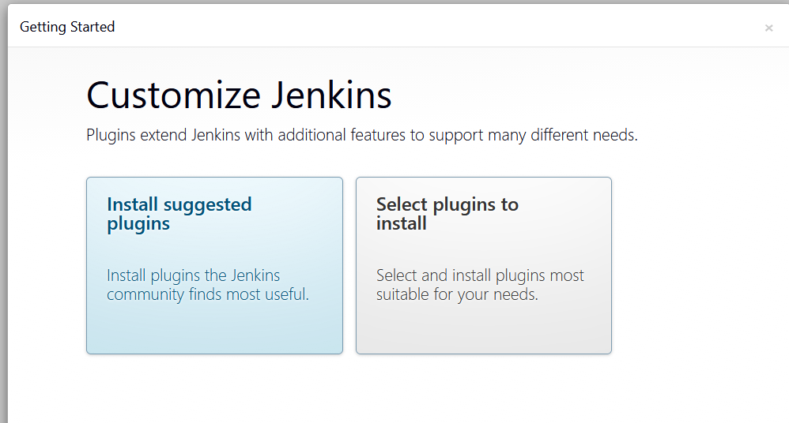

# Mini-Projet : Infrastructure Jenkins avec Terraform (AWS)

Ce projet déploie de manière entièrement automatisée une instance Jenkins sur AWS en utilisant Terraform pour l'Infrastructure as Code (IaC) et Docker pour le déploiement applicatif.

## 🚀 Fonctionnalités
- **Réseau :** Création d'un VPC, Subnet Public, Internet Gateway et Table de routage.
- **Sécurité :** Security Group configuré pour SSH (22) et Jenkins (8080).
- **Persistance :** Volume EBS attaché pour sauvegarder les données Jenkins (`jenkins_home`).
- **Automatisation :** Installation de Docker, Docker-Compose et configuration automatique des permissions Linux (`chown`) via `remote-exec`.
- **Accès :** Utilisation d'une Elastic IP (EIP) pour une adresse fixe.

## 🛠️ Pré-requis
- Terraform installé localement.
- Un compte AWS avec des identifiants configurés (`aws configure`).

## 📖 Comment déployer
1. **Cloner le dépôt :**
   ```bash
   git clone [https://github.com/yannick0405/mini-project-terraform-devops.git](https://github.com/yannick0405/mini-project-terraform-devops.git)
   cd mini-project-terraform-devops/app
      ```
   
 2.  **Initialiser Terraform :**
    
    Bash
    terraform init
   
    ```

2.  **Déployer l'infrastructure :**
   ```  
    Bash
terraform apply -auto-approve 
```  


3.  **Accéder à Jenkins :** 

Une fois terminé, utilisez l'IP publique affichée dans les outputs : `http://<IP_PUBLIQUE>:8080`
    

## 🔑 Récupérer le mot de passe administrateur

Connectez-vous en SSH et exécutez la commande suivante :
```
Bash


sudo docker exec $(sudo docker ps -q) cat /var/jenkins_home/secrets/initialAdminPassword


 
